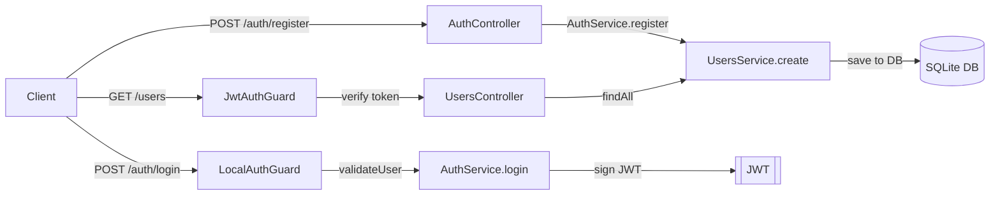

## Authentication

A simple JWT-based auth using Passport and bcrypt:

1. **Register** (`POST /auth/register`):
   - Hash password with bcrypt and save user via TypeORM (SQLite).
2. **Login** (`POST /auth/login`):
   - Validate creds with Passport Local.
   - Return `{ access_token }` signed by NestJS JWT.
3. **Secure routes**:
   - Send `Authorization: Bearer <token>` header.
   - Passport JWT guard verifies token and sets `req.user`.

Key packages: @nestjs/passport, passport-local, @nestjs/jwt, passport-jwt, bcrypt, class-validator, TypeORM

## Authentication Validation Flow Details

1. **Local Strategy (Login)**

   - The `LocalAuthGuard` triggers Passport’s `LocalStrategy`.
   - `LocalStrategy.validate()` calls `AuthService.validateUser(username, password)`.
   - Inside `validateUser`:
     1. `UsersService.findOne(username)` looks up the user in the SQLite DB.
     2. `bcrypt.compare(password, user.password)` checks the plain‐text password against the stored hash.
     3. If it matches, the method strips out the `password` field and returns the user object; otherwise it returns `null`.
   - Passport then either attaches the user to `req.user` (success) or rejects with 401.

2. **JWT Issuance**

   - On successful login, the controller calls `AuthService.login(req.user)`.
   - `AuthService.login()` builds a payload `{ username, sub: user.id }` and calls `JwtService.sign()`.
   - The signed token is returned as `{ access_token: '<JWT>' }`.

3. **Protected Routes (Authorization)**
   - Clients include `Authorization: Bearer <access_token>` on requests.
   - `JwtAuthGuard` uses Passport’s `JwtStrategy`:
     1. `ExtractJwt.fromAuthHeaderAsBearerToken()` pulls the token from the header.
     2. The strategy verifies the signature and expiration against the secret.
     3. On success, `JwtStrategy.validate(payload)` returns `{ userId: payload.sub, username: payload.username }`.
     4. Passport sets this object as `req.user`.
   - Controllers can then safely access `req.user` knowing the request is authenticated.
